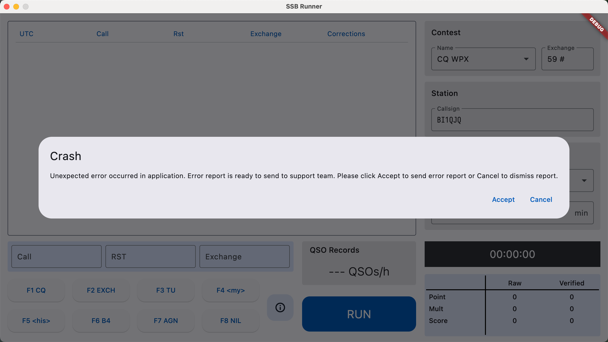

# SSB Runner

SSB Competition Listening Training Software

inspired by [MorseRunner](https://github.com/w7sst/MorseRunner)

## Downloads

Please visit our [website](https://ssbrunner.com/) 

or download release from [Releases Page](https://github.com/SSBContestRunner/ssb_runner/releases) in GitHub

## If you encounter crash

If you see the crash dialog, click **Accept**, there will be a log file in the following directory.

Windows: `%USERPROFILE%\Documents\ssb_runner\log`

macOS: `~/Documents/ssb_runner/log`

Linux: `~/Documents/ssb_runner/log`

Please open an issue and attach the log file to it.
