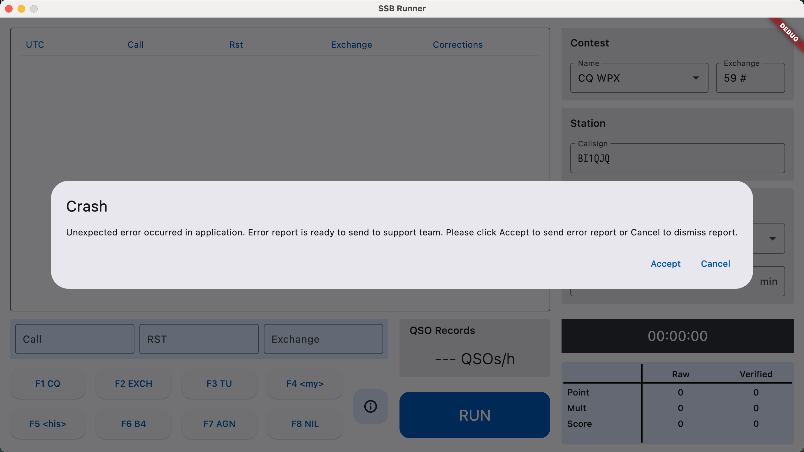

# SSB Runner

SSB Contest Listening and Training Software

inspired by [MorseRunner](https://github.com/w7sst/MorseRunner)

## Training capabilities

- Rule registry with CQ WPX SSB, CQ WW SSB, ARRL DX SSB, IARU HF SSB, and
  JIDX SSB practice templates.
- Run, Search & Pounce, and overlapping-caller Pile-up exercises.
- Beginner, Standard, and Advanced audio profiles: playback speed, a constant
  receiver noise bed, in-signal noise, and QSB fading.
- Deterministic practice seeds. A session records a `questionSeed` (callsigns,
  exchanges, pile-up candidates, phonic choices) and an `audioSeed` (noise bed,
  in-signal noise, QSB phase) so a session can be reproduced or fully replayed
  from its recorded answer log.
- Post-session review with QSO count, accuracy, rate, score, error categories,
  and a one-click replay of the same practice seed.
- Configurable F1–F8 commands and incoming-station audio volume.

The additional templates are explicitly **single-band training profiles**.
They are not Cabrillo-log certification: official multi-band scoring also needs
the event's category, band, date, and current rule revision.

## Downloads

Please visit our [website](https://ssbrunner.com/) 

or download release from [Releases Page](https://github.com/SSBContestRunner/ssb_runner/releases) in GitHub

### Supported platforms

Only the desktop platforms below are packaged and released; the Android, iOS,
and Web scaffolds are not release targets.

| Platform | Architecture | Minimum version |
| --- | --- | --- |
| Windows | x64 | Windows 10 or 11 |
| macOS | Universal — Apple Silicon and Intel | macOS 12 Monterey or later |
| Linux | x86_64 | glibc 2.35+ — Ubuntu 22.04 / Debian 12 or newer |

#### Artifacts

- **Windows** (x64)
  - `.zip` — portable; unzip and run `ssb_runner.exe`. The MSVC runtime DLLs are
    bundled, so no installer — and no separate VC++ Redistributable — is needed.
- **macOS** (universal; runs natively on both Apple Silicon and Intel Macs)
  - `.dmg` — drag **SSB Runner.app** into *Applications*.
- **Linux** (x86_64)
  - `.deb` — install with `apt`, which also pulls in the EGL/GLES runtime the
    Flutter engine loads.
  - `.AppImage` — mark it executable and run it.
  - `.zip` — portable; unzip and run.

Releases are currently **unsigned**. On first launch:

- **Windows** — SmartScreen may warn about an unknown publisher; choose
  *More info → Run anyway*.
- **macOS** — right-click the app and choose *Open*, or allow it under
  *System Settings → Privacy & Security*.

## If you encounter crash

If you see the crash dialog, click **Accept**. Log files are written to the
application data directory, under `log/`:

- Windows: `%APPDATA%\com.ssbrunner\ssb_runner\log`
- macOS (release builds run sandboxed):
  `~/Library/Containers/com.ssbrunner.app/Data/Library/Application Support/com.ssbrunner.app/log`
  (non-sandboxed debug builds use
  `~/Library/Application Support/com.ssbrunner.app/log`)
- Linux: `~/.local/share/com.ssbrunner.app/log`

You can also open **Diagnostics → Export logs** in the settings panel, which
saves a zip of the logs into your Documents folder and copies its path to the
clipboard; **Copy diagnostics** puts the summary straight on the clipboard.

Please [open an issue](https://github.com/SSBContestRunner/ssb_runner/issues/new) and attach the log file (or the exported zip) to it.
